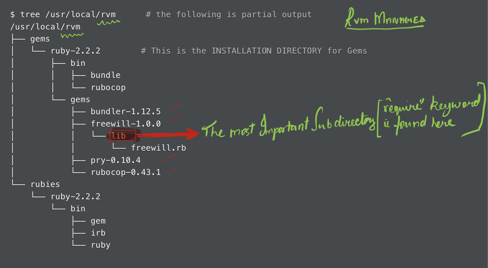

# BLOCKS

## 1. What are closures?

Closures are "chunk of code" that can be saved and passed around to be executed at a later stage. There are three main ways to implement **closures** in Ruby. They are:-

1. Through an object created from the `Proc` class
2. a `lambda` or
3. a block

## 2. What is binding?

When a closure is created it **binds** to the surrounding artifacts such as variables, methods, objects, etc. Thereby creating an enclosure. Now the closure or the `chunk of code` remembers and retains the references to these artifacts from the time of its creation.

## 3. How does binding affect the scope of closures?

The arifacts (variables, constants, methods, etc) which are available to the closures is defined by when the closure was initialized rather then when it is executed. Closures maintains its references to the artifacts at the time of it's creation. (Block retains the memory of the surrounding scope)

scope of the block and its surrounding artifacts
	- block remembers the scope of the block when the closures are created this is also known as binding
	- due to this the artifacts can be modified even when the closures are called at a later part of the code

## 4. What are Blocks and how do they work?

Blocks are arguments passed to the method during the method invocation. Blocks are called as anonymous or unnamed methods. When a method is invoked with a block. The chunk of code delimitted by the `do...end` keyword or the `{}` curly braces denotes the block. All methods in Ruby take an optional block as an implicit argument. The method implementation will dictate if the block is utilized or ignored. Blocks retains(remember) the memory of the surrounding scope. Due to this we can update the variable in that scope even when the closures are called in a different part of the program

**side note,:** Know the difference between method invocation and method implementation

**Method implementation**:- This is the method definition and the logic it encloses

**Method invocation** : - This is the actual method call.

## 5. Yielding

The `yield` keyword within the method definition (in the method implementation) executes the block which is passed in during the method invocation. The `yield` keyword helps us to inject additional code into the method without changing the method implementation. (Major use case of a block ). Allows for some flexibility when the method is invoked.

```ruby
def student
  yield
end

student { puts "I am a student" } #==> "I am a student"
```

### LocalJumpError

When we invoke a method without a block passed in as an argument,  which has the keyword `yield` in its method implementation we get an error known as `LocalJumpError`. We can use the `Kernel#block_given?` inconjunction with an `if` statement inorder overcome this error.

### Code Explaination - Yielding with an argument

```ruby
# method implementation
def student(name)
  yield(name) if block_given?
end

# method invocation
student("Bob") { |student_name| puts "My name is #{student_name}!" }
# => "My name is Bob!"
```

In `line 8` the `student` method is invoked and the string `"Bob"` is passes as an argument to it. We are also passing an **implicit** block which also takes an argument. In `line 2` the method parameter `name` is assigned to the string `"Bob"`. This method parameter acts as a method local variable within the method definition. The block is passed in implicitly without being assigned to a local variable. In the method implementation `line 3` yields to the block. The block also takes a block  parameter. here the value referenced by `name` is set to the block parameter `student_name`. The block executes and the string `"My name is Bob!"` is output after the value referenced by the block local variable `student_name` is interpolated. The execution then comes back to the method implementation untill the method ends. Since the last evaluated expression within the method is the return value of the block. The return value of the method in this case is `nil`.

### block parameter / block local variable.

### Variable shadowing

Within the block,  the **block parameter** acts as the block local variable and it follows the scope of a local variable within a block. We have to use unique names for  block parametes inorder to prevent `variable shadowing`. Variable shadowing occurs when the block parameter and the local variable initialized in the outer scope have the same name. In this case within the block, the block parameter hides the local variable in the outer scope (i.e. they are not accessible within the block). This can be overcome by using unique names.

### Passing extra or less arguments to a block

When extra arguments are passed to a block they are ignored. All uninitialized block parameter will evaluate to `nil`.

## 6. What is Arity in Ruby?

In Ruby Arity is the rule which defines the number of arguments that you can pass to the `Proc` object, `lambda` or the block.  The blocks and `procs` have **lenient arity** where the argument count is not enforced and hence no error is raised if we pass in more or less arguments than required.  The methods and `lambda`s have a **strict arity** where the argument count is enforced, which means that we have to pass in the same amount of arguments as defined.

## 7. Blocks use cases

1. Defer some implementation code to method invocation decision

   This allows to the method caller to refine the method implementation during the method invocation with a block without modifying the method implementation. The method implementation has a generic use case and its functionality is refined when additional code is injected by passing a block during the method invocation.

2. Sandwich code - Methods that need to perform some `before` and `after` action. Example compare the time before and after execution. Some of the examples of `sandwich code` are the things that require a `before/after` actions such as timing, logging, notification systems, etc. Resource management and interfacing with the operator systems are other examples.

## 8. Methods with explicit block parameter

Using the ampersand `&` character

The explicit block is treated as a **named object** which can be assigned to a method parameter. To define an explicit block we add the `&` to the beginning of the parameter. This way the block argument is converted into a `Proc` object. When referencing the block parameter within the method we commit the `&` character. Since we have a variable that references the block we can now pass the block to another method. This provides additional flexibility.

```ruby
def test2(string)
  puts string
end

def test(block) # here we are creating a proc object by using the & sign
  str = block.call
  test2(str)
end

sentence = Proc.new {"Hello how are you?"}
puts sentence.call
# => "Hello how are you?"

test(sentence)
# => "Hello how are you?"
```

In the above example in `line 10` we are explicity creating a `Proc` object. In `line 11` we are calling `proc` using the method `call` which outputs `Hello how are you?`. Now we are passing this `Proc` object as an argument to the `test` method invocation on `line 14` . The method executes and the string ` "Hello how are you?"` is output.

```ruby
def test2(string)
  puts string
end

def test(&block) # here we are creating a proc object by using the `&` sign
  str = block.call # we are invoking the Proc here
  test2(str)
end

test {"Hello how are you?"}
# => "Hello how are you?"
```

In the above example in line 10 the `test` method is invoked and is passed in as an implicit argument to it. In line 5 in the method definition `&block` block parameter converts the block into a `proc` object and the block is assiigned to it. Now the proc object is passed around as a normal object and the string `"Hello how are you?"` is output when the method completes its execution.

**Note** : Methods or blocks when they return a closure, they can't return blocks but  can return `Proc` objects. This is one of the benefit of using a Proc over an implicit block.

## 9. Block scope and its artifacts

scope of the block and its surrounding artifacts
	- block remembers the scope of the block when the closures are created this is also known as binding
	- due to this the artifacts can be modified even when the closures are called at a later part of the code
	eg.,

```ruby
def for_each_in(arr)
  arr.each { |element| yield element }
end

arr = [1, 2, 3, 4, 5]
results = [0]

for_each_in(arr) do |number|
  total = results[-1] + number
  results.push(total)
end

p results
```
here the local variable results is available inside of the method `for_each_in` though the results local variable is initialized outside of the method. This is facilated through the closure.

```ruby
def sequence
  counter = 0
  Proc.new { counter += 1 } # here the Proc object forms a closure with the local variable counter.
end
# last evaluated expression in the above method is the Proc object

s1 = sequence # following three methods are called on the same instance of the sequence method
p s1.call # 1 the proc object in all of the s1 sequence have their own private copy of the method local variable counter
p s1.call # 2
p s1.call # 3
puts

s2 = sequence
p s2.call # 1
p s1.call # this returns 4 because this is still part if the same sequence in s1
p s2.call # 2

# the above occurs because since we are incrementing the private copy of the local varible `counter` corresponding to the respective `sequence` method invocation

# creating multiple procs from the `sequence` methods creates its own private copy of the local variable `sequence`.
# everytime the method `sequence` is invoked a new Proc object is created which keeps its own copy of the method local variable `counter`.
```

**Note** : Methods or blocks when they return a closure, they can't return blocks but  can return `Proc` objects. This is one of the benefit of using a Proc over an implicit block.

## 10. Building our own times method

### Original times method behaviour

```ruby
5.times do |num|
  puts num
end

# 0
# 1
# 2
# 3
# 4
# => 5
```

### Times method implmentation

```ruby
# method implementation
def times(num)
  (0...num).each { |num| yield(num) }
  num
end

# method invocation
p times(5) { |num| puts num }

# 0
# 1
# 2
# 3
# 4
# => 5     ----> This is the returned value
```

### LS implementation

```ruby
# method implementation
def times(number)
  counter = 0
  while counter < number do
    yield(counter)            # yielding the execution to the block while also passing an argument to the block.
    counter += 1
  end

  number                      # return the original method argument to match behavior of `Integer#times`
end

# method invocation
times(5) do |num|
  puts num
end

# Output:
# 0
# 1
# 2
# 3
# 4
# => 5
```

here we are `yielding the execution to the block` and also passing an argument to the block. During the method invocation we are passing in a block that takes an argument

## 11. Build an each method

### Original implementation

```ruby
#each method
[1, 2, 3].each { |num| puts "do_nothing" }
```

Here the `Array#each` method iterates over an array of integers and yielding each element to the block, applying the logic within the block to the elements in each iteration. `#each` method always returns the calling object.

### Own implementation

```ruby
# Own implementation of the each method which iterates over an array and displays it while returning the calling object
def each(array)
  counter = 0

  loop do
    yield(array[counter])
    counter += 1
    break if counter == array.size
  end

  array
end

p each([1, 2, 3]) { |num| puts num }

# 1
# 2
# 3
# => [1, 2, 3]
```

### LS Implementation

```ruby
def each(array)
  counter = 0

  while counter < array.size
    yield(array[counter])                           # yield to the block, passing in the current element to the block
    counter += 1
  end

  array                                             # returns the `array` parameter, similar in spirit to how `Array#each` returns the caller
end

each([1, 2, 3, 4, 5]) do |num|
  puts num
end

# 1
# 2
# 3
# 4
# 5
# => [1, 2, 3, 4, 5]
```

Blocks helps the method callers to add additional details during the method invocation by passing in a block. After the block is executed then the execution is returned back to the while loop in the above example.

## 12. Build select method

### Own implementation

```ruby
# build a custom #select method to fullfill the following test cases

array = [1, 2, 3, 4, 5]

select(array) { |num| num.odd? }      # => [1, 3, 5]
select(array) { |num| puts num }      # => [], because "puts num" returns nil and evaluates to false
select(array) { |num| num + 1 }       # => [1, 2, 3, 4, 5], because "num + 1" evaluates to true
```

### Solution

```ruby
def select(array)
  arr = []

  array.each do |num|
    arr << num if yield(num)
  end

  arr
end

array = [1, 2, 3, 4, 5]

select(array) { |num| num.odd? }      # => [1, 3, 5]
select(array) { |num| puts num }      # => []
select(array) { |num| num + 1 }       # => [1, 2, 3, 4, 5]
```

In `line 4 - 6` the `each` method iterates over the collection and it yields the current element to the block. Within the block taken by the `each` method we are yielding the current element to the block passed in as an implicit argument to the `select` method invocation in `lines 13, 14 and 15`. This implicit block  takes a block argument as shown by the block parameter `num`. Within the block the block parameter `num` acts as a `block local variable` which is used by the logic within the block. If this implict block evaluates to `true` then the conditional in `line 5` executes thereby appending the current element into the array referenced by `arr`. Since `arr` is the last evaluated expression within the `select` method, a new collection is returned containing elements based on the truthiness of the return value of the block which is passed in implicitly during the `select` method invocation.

### Another Implementation (LS)

```ruby
def select(array)
  counter = 0
  result = []

  while counter < array.size
    current_element = array[counter]
    result << current_element if yield(current_element)
    counter += 1
  end

  result
end
```

## 13. Build reduce method

The main goal of the `#reduce` method is to `accumulate` or `fold` the given collection to one object. `#reduce` method takes a block and is invoked on the calling object. Unlike the `each` method `reduce` yields two arguments to the block. The first argument is the `accumulator` object and the second argument is the current element. Once the block executes the accumulator object is reassigned to the return value of the block.

### Implementation

```ruby
def reduce(array, starting_value=0)
  array.each do |num|
    starting_value = yield(starting_value, num)
  end
  starting_value
end

array = [1, 2, 3, 4, 5]

p reduce(array) { |acc, num| acc + num }                    # => 15
p reduce(array, 10) { |acc, num| acc + num }                # => 25
p reduce(array) { |acc, num| acc + num if num.odd? }        # => NoMethodError: undefined method `+' for nil:NilClass
```

In line `3` we are yielding two arguments to the block during the `reduce` method invocation. `starting_value` is then reassigned to the return value of yielding the two arrguments `starting_value` and `num` to the block. The expression within the block in `line 12` raises an error because the block returns `nil` when the Integer `2` is passed as an argument to it. Hence in the next iteration when we try to add the current element to the `nil` object it raises an error.

### LS Implementation

```ruby
def reduce(array, default=0)
  counter = 0
  accumulator = default

  while counter < array.size
    accumulator = yield(accumulator, array[counter])
    counter += 1
  end

  accumulator
end
```

### Add additional functionality

```ruby
def reduce(array, starting_value=nil)
  array = array.clone
  starting_value = array.shift if starting_value == nil

  array.each do |num|
    starting_value = yield(starting_value, num)
  end

  starting_value
end

array = [1, 2, 3, 4, 5]

p reduce(array) { |acc, num| acc + num }                    # => 15
p reduce(array, 10) { |acc, num| acc + num }                # => 25
p reduce(array) { |acc, num| acc += num if num.odd?; acc }  # => 9
p reduce(['a', 'b', 'c']) { |acc, value| acc += value }     # => 'abc'
p reduce([[1, 2], ['a', 'b']]) { |acc, value| acc + value } # => [1, 2, 'a', 'b']
```

In `line 2` we are creating a copy of the array object by calling the method `clone` because if the conditional in `line 3` evalutates to `true` then the expression `array.shift` will permanently modify the original `array` calling collection by removing the first element and returning it. This will cause the return values of the other test cases to behave in an unexpected way.

## Symbol #to_proc

1. reference - [explaination 1](https://blog.pjam.me/posts/ruby-symbol-to-proc-the-short-version/)

```ruby
a_proc = proc { |a, b, c| p a, b, c }
a_proc.call(1, 2, 3)
# => 1
# => 2
# => 3

a1_proc = proc { |x| p x.even? }
a1_proc.call(1)
# => false

a2_proc = :even?.to_proc
p a2_proc.call(2)
# => true
```

In `Line 11` in the expression `:even?.to_proc` we are creating a `Proc` object using the `Symbol#to_proc` method. This is same as the expression `proc { |x| p x.even? }`. The `Symbol` class has a `to_proc` method.

in the expression `[1, 2, 3, 4].map(&:to_s)` `to_proc` from the `Symbol` class returns a simple `Proc` which sends the symbol(self) to the object yielded by the enumerator.

```ruby
class Test
  def self.to_proc
    proc { puts "What are you doing?" }
  end
end

def a_method(&block)
  block.call
end

a_method(&Test)
# => "What are you doing?"
```

In the expression `a_method(&Test)` we are passing our custom `Test` class as an explicit block during the `a_method` invocation. Since it has a `#to_proc` class method within the class, the expression in line 8 `block.call` executes and this outputs `"What are you doing?"`

# Testing

## Minitest

Common types of testing used by the Ruby community

1. Minitest - aka (Unit testing)
   - Used to be distributed with ruby
   - simpler and straight forward syntax. It's just Ruby
   - can do everything RSpec can do
   - not a **DSL** domain specific language
   - Can use a DSL
2. RSpec
   - Is a **DSL** (Domain specific language) for writing tests
   - Reads like natural English

## Test Suite, Test and Assertion

### Test Suite

All the tests used in a project or the application under question.

### Test

The situation or the context in which the tests are run. A test can have multiple **assertions**.

### Assertions

The step to verify that the data returned by the by the application is as expected. A test can have multiple assertions.

## A test file and its components


In the above snippet of code `line 3` denotes the required file that we will be testing. `Line 5 to line 10` denotes the denotes the test class we are creating which inherits from `Mintiest::Test`. `Line 6 to line 9` denotes the test (which will always start with a `test_`) that will be run. A test can have many assertions. Line 7 denotes the data or the object that we will be making the assertions against. The assertions take two parameters. The first is the expected value and the other is the actual or the test value.

### seed, fail and skip


Seed - Order in which Ruby dictates Minitest to run the tests in the test suite.

F - means the test has failed

S - Means that we have skipped a test. A particular keyword can be skipped by using the `skip` keyword. Inorder for the Minitest to skip the test we will have to put the `skip` keyword at the beginning of the test. A string can be passed to the skip keyword if a custom message was required.

The test output can be made to look aesthetically appeasing by installing and using the `minitest_reporters` gem. This is known as colorizing the output.

## Types of Syntax

Minitests can be written using assertions (assert-style syntax) and expectation matchers (spec style syntax) as follows

### Assert  type syntax


In the assertion-style syntax we use a test class and test which has assertions

### Expectation Style syntax


In the expectation/spec-style syntax we have a `describe` block which groups the tests and the tests are written in the `it` method. The `assertions` are replaced by `expectation matchers`.

## Refutations

The opposite of assertions is refutations. Instead of `assert` they `refute`.

## SEAT approach

The 4 steps to run any test.

* Set up the object
* Execute the code against the object being tested - (E is a simple object instantiation)
* Assert the result of the execution.
* Tear down - clean up any artifacts which are lingering.

The `setup` method is invoked before each test and the `teardown` method is invoked after running every test.

## Testing Equality

Testing for equality

value equality - We check for the values to be equal using the assertion `assert_equal`

strict object equality - We check if the objects being compared are the same `assert_same`


## Code Coverage

Code coverage depicts the percentage of the code that is covered and tested by our test suite. When the code coverage is 100% it does not mean that the program is running flawlessly or all the edge cases are taken care off. Instead it means that there is a test available for all the methods that are present within the application being tested. Though it is not perfect we can use code coverage to measure the quality of the code being tested. Here we will install a gem called `simplecov` using the command `gem install simplecov`. Then we insert the following code at the beginning of the test file

```ruby
require 'simplecov'
SimpleCov.start
```

When we run the test file for the next time a new directory is generated in the file system called `coverage`. Within which there will be a file with name `index.html` which will display the code coverage data. Add more tests if you need to increase the code coverage based on the project requirements.


# Packaging code into a project

## Core tools book

### Gems

Packages of code which can be downloaded, installed and used in a Ruby program or from the command line. The gems in Ruby are managed by the `gem` command. There are many gems available such as `rubocop, rails, pry, sequel, etc,.`.The `gem` command is part of the standard installation since version 1.9. Gems can be installed from a local library or a remote library such as `RubyGems Library` or a local employer library.

### Local Library

`Local library` is where the files and commands needed are placed in our local file system when we install a Gem using the `gem` command .

### Gems and Local file system

Run the `gem env` command to explore the details of the RubyGems installation. This will print out the path where the files are located.

```
RubyGems Environment:
  - RUBYGEMS VERSION: 2.4.8
  - RUBY VERSION: 2.2.2 (2015-12-16 patchlevel 230) [x86_64-linux]
  - INSTALLATION DIRECTORY: /usr/local/rvm/gems/ruby-2.2.2
  - RUBY EXECUTABLE: /usr/local/rvm/rubies/ruby-2.2.2/bin/ruby
  - EXECUTABLE DIRECTORY: /usr/local/rvm/gems/ruby-2.2.2/bin
    ...
  - REMOTE SOURCES:
     - https://rubygems.org/
  - SHELL PATH:
     - /home/ubuntu/.nvm/versions/node/v4.5.0/bin
     - /usr/local/rvm/gems/ruby-2.2.2/bin
     - /usr/local/rvm/gems/ruby-2.2.2@global/bin
     ...
```

the above snippet of code varies with different configurations.

### Ruby installation directory

Gems are installed here by default. `system level directory` is the location in the home directory where the `gem` uses.



### Ruby version managers

- `rvm` & `rbenv` (most popular)

Ruby version managers are used to install, manage and use multiple versions of Ruby.

### rvm

**rvm** defines a shell function which modifies the PATH variable to use the correct ruby version

| Commands                     | Description                                                  |
| ---------------------------- | ------------------------------------------------------------ |
| `rvm list rubies`            | displays the list of ruby versions installed                 |
| `rvm install 2.2.2`          | installs the given version                                   |
| `rvm use 2.3.1 --default`    | defining a default version                                   |
| `rvm --ruby-version default` | setting up the ruby version for the current project          |
| `rvm use 2.2.2`              | this command modiifies the environment to ensure that the first ruby your system finds is version 2.2.2 |
| `rvm info rvm`               | gives the RVM path denoted by the `path` entry               |
| `rvm get latest`             | download and install the latest version of the RVM           |

rvm provides **gemsets** which are simillar to **bundler**. Bundler is more widely used than gemsets.

### rbenv

| Keywords and commands | Description                                                  |
| --------------------- | ------------------------------------------------------------ |
| shims                 | These are small scripts used by **rbenv**<br /> they have the same names as the various ruby and Gem programs<br />Valid rbenv installations include the shims directory in the `PATH`<br />The system searches the **shims** directory first as rbenv places this directory before other directories |
| `rbenv versions`      | displays the list of Ruby versions available                 |
| `ruby-build`          | rbenv plugin to install new Rubies (unlike rvm this functionality is not available by default)<br />After installing the plug-in run `brew install ruby-build` (if we are running on homebrew)<br />To install a new version run `rbenv install 2.2.2` (this is the final step to install the required Ruby version) |
| `rbenv global 2.3.1`  | to set the default version of ruby                           |

### Bundler

Multiple versions in Ruby are managed using the version manager such as `rvm` or `rbenv`. Gem dependencies can also be managed using version managers but the preferred approach is to use a **dependency manager**. The most commonly used dependency manager in Ruby is the **Bundler** gem. The gem is installed using the command `gem install bundler`.

### Gemfile and Gemfile.lock

#### Gemfile

Bundler depends upon a file called Gemfile to find out the correct version of Ruby and the Gem versions. This file is written in DSL - Domain Specific language to provide the details of the Gem and Ruby versions. It is the instruction file for the Bundler.

### Gemfile.lock

When we run the `bundle install` command the Gemfile is scanned and all the dependencies(Gems and versions that is required) listed in it are downloaded and installed. A `Gemfile.lock` is also produced which shows all dependencies for the program including the Gems listed in the Gemfile and the other Gems they depend upon and create a large **dependency tree**.

When the Gemfile.lock is created add the following code to the top of the application(the application and its tests) to ensure that the app loads the desired Gems.

```ruby
require 'bundler/setup'
```

| code            | action                                                       |
| --------------- | ------------------------------------------------------------ |
| `bundler/setup` | removes all the Gem directories from Ruby's $LOAD_PATH and reloads only the directories required for the Gems in the `Gemfile.lock` |
| `require`       | Will find the correct versions for each Gem.                 |

### bundle exec

When would you use bundle exec?

It is used to resolve dependency conflicts when issuing shell commands.

For example; when we run `bundle exec rake` the environment changes so we run `rake` defined in the `Gemfile` instead of the system default.

```shell
bundle exec rake
```


# Packaging the code into a project


